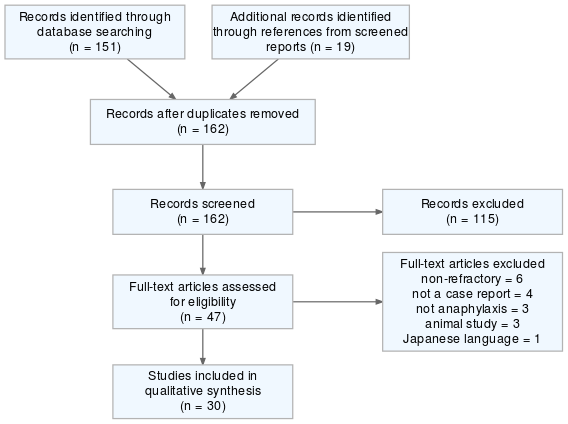
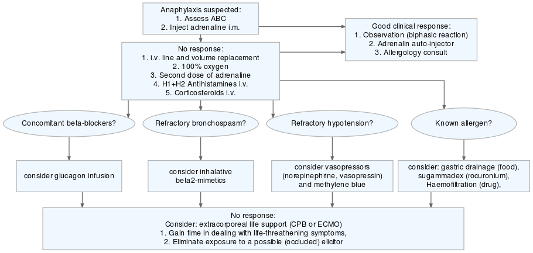

```{r, setup, echo = FALSE,include=F}
knitr::opts_chunk$set(
  collapse = TRUE,
  warning = FALSE,
  message = FALSE,
  echo = FALSE,
  comment = "#>",
  fig.path = "../figures/"
)

require(magrittr,quietly = T)
devtools::load_all(".",quiet = T)

```

Department of Dermatology, Venerology, and Allergology, Charité – Universitätsmedizin Berlin, corporate member of Freie Universität Berlin, Humboldt-Universität zu Berlin, and Berlin Institute of Health, Charitéplatz 1, 10117 Berlin,

**Corresponding author: **
Prof. Dr. med. M. Worm margitta.worm@charite.de
Phone: +49 30 450 529 005;      Fax: +49 30 450 529 902

**Keywords:** anaphylaxis; epinephrine; glucagon; hypotension; methylene blue; shock

# Introduction
Anaphylaxis is a potentially life-threatening, primarily mast cell-dependent reaction to most frequently food, drugs, insect venom. Although anaphylaxis remains to be a clinical diagnosis [@Kemp2014], it is highly likely if any of the following 3 criterita are fulfilled: 1) Acute onset of an illness with generalized skin / mucosal involvemt with flushing, hives or pruritus; 2) acute cutaneous, cardiorespiratory or gastrointestinal symptoms after exposure to a likely allegen; c) acute reduction of blood pressure (BP) after exposure to a known allergen [@Sampson2006]. The pathogenesis of anaphylaxis is related to a sudden, systemic, (mostly IgE dependent) degranulation of mast cells or basophils leading to the release of multiple mediators like histamine, tryptase, chymase, platelet-activating factor, prostaglandins, and leukotrienes [@Houser2015].

By contrast, the term refractory anaphylaxis has not been established yet. For the purpose of this review, we define refractory anaphylaxis as anaphylaxis (meeting the criteria by NIAID/FAAN  [@Sampson2006]) unresponsive to the treatment with at least 2 doses of a minimum 300 µg adrenaline. Unresponsiveness, in this case, is defined as a lack of expected normalization of clinical symptoms (i.e. rapid increase in blood pressure, bronchodilatation, tachycardia).

It is important to distinguish refractory anaphylaxis from recurrent anaphylaxis. In one case report authors used the term refractory anaphylaxis to describe 6 recurrent episodes of anaphylaxis associated with the monoclonal mast cell activation syndrome, which responded well to intramuscular doses of epinephrine [@Jagdis2014] and were ultimately treated with omalizumab. We did not include such reports into our analysis and suggest to use the term “recurrent” anaphylaxis instead of “refractory” in such cases. 

The incidence of anaphylaxis is increasing worldwide [@Koplin2011] and was lately estimated to be between 50 and 112 episodes per 100,000 person-years and an estimated prevalence of 0.3% to 5.1% [@TejedorAlonso2015].  It is widely believed to be an underrecognized and undertreated medical emergency [@Fineman2015]. Anaphylaxis in children is in the majority of cases food dependent and most likely less severe than episodes in adulthood [@Braganza2005]. Cases of refractory anaphylaxis are extremely rare. The incidence of refractory anaphylaxis was not investigated earlier and it is estimated (based on our data) to range between 3--5% of all cases of anaphylaxis.

Risk factors for anaphylaxis include age, food elicitors (cow's milk and hen's egg) in children and drug-induced anaphylaxis in adults as well as concomitant mastocytosis (or mast cell activation syndromes) [@Worm2013]. Severe anaphylaxis is more likely to be elicited in elderly patients, patients suffering from mastocytosis, and in temporal proximity to vigorous exercise (e.g. jogging) [@Worm2013]. Risk factors for _refractory_ anaphylaxis were not investigated previously. 

The management algorithms for anaphylaxis are based on consensus expert recommendations and might be incomplete when it comes to reactions that are not responding to the first line therapy. To date, the acute treatment of anaphylaxis is uniquely recommended in the international guidelines and the mainstay of therapy is the early administration of intramuscular (i.m.) adrenaline [@Lazar2017].
However, an optimal anaphylaxis treatment in a given patient is difficult to study because it is an emergency condition and placebo-controlled studies are limited for ethical reasons. Therefore most of the knowledge regarding the treatment of anaphylaxis is based on expert recommendations which are graded as low-level evidence sources.

In the present analysis, we aimed to evaluate the management and risk factors of refractory anaphylaxis to highlight possible clinical implications for updating current management algorithms.

We performed a database search in the "PubMed" database using the "RISmed"[@rismed] package for R statistical software [@R]. The search terms contained the words "refractory anaphylaxis" in articles published from 1950 till 2017. The search was conducted on 16.11.2017 and returned 150 results. All case reports of patients who experienced an anaphylactic event and did not respond to at least 600 µg of adrenaline were included in this study. Articles in English, Portuguese, French, and Spanish were included in the analysis, one article in Japanese was excluded. Additionally, case reports referenced in the included sources were added. We excluded reviews and articles not containing a case description as well as cases which documented an appropriate response to injected adrenaline. Also, cases describing mast cell activation syndrome and refractory vasoplegia without the definitive diagnosis of anaphylaxis were not included. We finally included `r unique(d$Source) %>% length()` Papers reporting `r d$Author %>% length()` cases of anaphylaxis. The detailed inclusion flowchart is illustrated in Fig \@ref(fig:prismaflow). 

We collected information about the elicitors, clinical setting, concomitant diseases, medication, reaction symptoms, therapy and outcomes of the treatment. We used piloted polls to gather the data and all reports were screened once by the same researcher. We investigated which interventions were reported as successful in the treatment of anaphylactic hypotension that was not responding to injected (i.v. or i.m.) adrenaline. Successful and unsuccessful management of anaphylaxis was one of the most important outcomes we evaluated. This information was available in all cases. All of the studies were case reports, therefore, the evidence level was classified as low. The review protocol was not established prior to the review and the review did not undergo preregistration. It is important to mention that as a review of case reports this study did not use control groups to compare outcomes and its statistical validity is therefore limited. 

## Risk factors for refractory anaphylaxis

A major risk factor for refractory anaphylaxis is perioperative anaphylaxis. In `r (d$Situation_gr=="OP") %>% which %>% length()` (`r ((d$Situation_gr=="OP") %>% which %>% length()/length(d[,1])*100) %>% round(1)`%) cases the anaphylactic reaction occurred during a diagnostic or surgical procedure. The most common causes of refractory anaphylaxis based on the analyzed case reports were iatrogenic procedures including anesthesia drugs, aprotinin, and protamine, radiocontrast media (RCM). Surprisingly, no cases of insect venom anaphylaxis were found among these reports (see Table \@ref(tab:demograph)). While the incidence of perioperative anaphylaxis has been reported to be between 1 in 10,000 -- 20,000 anesthesia procedures, it has a relatively high fatality rate of 3 -- 10% of the perioperative fatalities. [@Nag2017]


An early diagnosis of anaphylaxis during operative procedures can be suggested based on end-tidal CO~2~ collapse, which often is preceding cardiac arrest, even in the absence of any cutaneous manifestations. [@Baumann2009] In such case - treatment with adrenalin should be immediately initiated as delayed adrenaline use has been linked to increased mortality [@Simons2010] and refractoriness to adrenaline [@Fineman2015].


## Therapy of refractory anaphylaxis

Most of the treatment strategies were in accordance with the guidelines of anaphylaxis management [@Simons2011] but were supplemented by additional procedures that have saved patients' lives when first-line therapy failed (Table \@ref(tab:wholeTab)). We report on the most frequent procedures in order to evaluate them in the treatment of refractory anaphylaxis. 

Based on the analyzed reports, out-patients were first treated with adrenaline, whereas patients experiencing anaphylaxis under anesthesia were usually first given intravenous volume replacement and 100% oxygen, adrenaline followed by steroid and antihistaminic agents. Epinephrine was given in all cases in various doses. 

4 fatal cases (`r (length(which(d$Death=="yes"))/length(d$Death)*100) %>% round(1)`%) which did not respond to any therapy are listed in the table \@ref(tab:tabFatal). 

The World Allergy Organisation guidelines on anaphylaxis management suggest that refractory anaphylaxis should be treated with intubation, ventilation, intravenous vasopressors, glucagon and anticholinergic drugs [@Simons2011]. Patients should be transported to a critical care unit. The AAAAI [@Lieberman] is suggesting a similar treatment but include dopamine, vasopressin, glucagon atropine, and methylene blue if epinephrine injections and volume expansion fail to alleviate hypotension. Also, the EAACI [@Muraro2014] guidelines suggest using glucagon in case of concomitant beta-blockade.

## Methylene blue for the treatment of refractory hypotension

`r which(d$What.helped_gr=="methylene blue") %>% length` reports (`r ((which(d$What.helped_gr=="methylene blue") %>% length)/length(d$What.helped_gr)*100) %>% round(1)`%) reported using methylene blue to treat refractory anaphylaxis and indicated a rapid (within minutes) increase in blood pressure after the injection of methylene blue. It was both given as a bolus and as an infusion with the doses ranging from 0.5-2mg/kg. Patients responded well to the treatment with methylene blue and a second infusion (or bolus) were successfully given in case of a recurrent hypotension within hours of the anaphylactic episode. 

The hypotension in anaphylaxis is mediated mainly through histamine [@Enjeti1983] which stimulates the endothelial nitric oxide synthase (eNOS) to produce nitric oxide (NO). NO subsequently activates the soluble guanylate cyclase (sGC) which is responsible for the production of cGMP out of guanosine triphosphate (GTP) [@Lucas2000]. This leads to the opening of the calcium ion channels in smooth muscle tissues and the subsequent loss of vascular muscle contractility [@Omar2015].

Methylene blue is a well-investigated drug to treat patients with methemoglobinemia [@Schirmer2003]. Buzato et al. investigated its properties as an inhibitor of the nitric oxide-cyclic guanosine monophosphate (NO-cGMP) pathway in rabbits and suggested that the primary action of methylene blue is mediated by the sGC inhibition. Therefore it is able to stop the vasoplegia mediated through the increased production of cGMP [@Buzato2005].

Although the mechanism of action is thought to counteract the vasoplegia related hypotension, one case report successfully used methylene blue in the treatment of anaphylaxis without hypotension [@Bauer2013]. The authors suggested that the inhibition of GC may result in a decrease of histamine and platelet-activating factor (PAF) production which are potent mediators of anaphylaxis [@Moritoki1992].

Data about the use of methylene blue in the current management of anaphylaxis are scarce. We received no reports of methylene blue use in our International Registry of Anaphylaxis which contains over 10,000 cases to date.  

In case of a refractory anaphylaxis with severe persisting hypotension we propose to apply a 100 mg bolus i.v. followed by an infusion of 50 µg/kg/min. As a vector, a 100 mL of 5% dextrose can be used.  

As methylene blue does not block nitric oxide production its side effects are minimal (nausea, vomiting, abdominal pain, fever, hemolysis, hypotension, methemoglobinemia, arrhythmias, bluish skin, urine discol- oration, and hyperbilirubinemia [@Evora2007]). It may be considered a safe option for the treatment of anaphylaxis upon intensive care conditions. No side effects were reported due to methylene blue use in the reported-cases. 

Clinicians must be aware that methylene blue may provoke false pulse-oximetry readings as the blue dye mimics cyanosis [@Kessler1986].

## Vasopressors

In case of a hypotension refractory to adrenaline or volume replacement therapy -- vasopressors can be considered. Vasopressors were used in `r (d$t_vasopression==T) %>% sum` (`r (((d$t_vasopression==T) %>% sum)/((d$t_vasopression==T) %>% length)*100) %>% round(1)`%) of refractory cases. 
Vasopressin or its synthetic analogue terlipressin were used in `r sum(d$t_vasopressin)` cases. In 8 of these reports (`r (8/sum(d$t_vasopressin)*100) %>% round(1)`%) the injection of vasopressin reversed the refractory hypotension within minutes. 
Other vasopressors included metaraminol 
[`r which.sources(d$Source,"metara",list(d$What.helped,d$Therapy))`], methoxamine 
[`r which.sources(d$Source,"methox",list(d$What.helped,d$Therapy))`], dopamine 
[`r which.sources(d$Source,"dopam",list(d$What.helped,d$Therapy))`], and noradrenaline [`r which.sources(d$Source,"nor",list(d$What.helped,d$Therapy))`] infusions.
Drugs given perioperatively were the eliciting factors in all but two of these cases (`r round((length(d[temp.v,1])-2)/length(d[temp.v,1])*100,1)`%) and all patients reacted within minutes (range 5 - 20) upon exposition to the suspected drug. One patient reacted to systemic immune therapy (SIT) injection that was inadvertently extremely high-concentrated [@Bickell1984] and in one case the elicitor could not be established [@Heytman2004].  

The use of vasopressin in refractory anaphylaxis was only suggested in the management recommendations from the AAAAI [@Lieberman] and was never vastly investigated. Dopamine, however, is recommended by 2 out of three guidelines. Nevertheless, dopamine might be related to a higher risk of mortality and adverse events than epinephrine or norepinephrine [@Avni2015]. Both norepinephrine and vasopressin may be appropriate second-line agents for the management of refractory hypotension. Vasopressin acts on the V1 receptors, while norepinephrine acts primarily on the alfa-adrenergic receptors, their synergistic effects may result in effective vasoconstriction [@DiChiara2008].

Seedat et al. described a case of anaphylaxis while undergoing a bilateral knee arthroscopy under general anesthesia. The refractory shock was not responding to repeated adrenaline (total 2 mg), antihistamines and hydrocortisone [@Seedat2014]. A rapid response was achieved with the last resort injection of 1 U ornipressin that was repeatedly effective when the biphasic reaction occurred. The authors concluded that vasopressin or ornipressin should be considered for the treatment of adrenaline-resistant anaphylactic shock before resuscitation is discontinued [@Seedat2014]. We support the use of vasopressin in refractory hypotension, combined with norepinephrine infusions. 

One case report described the use of military anti-shock trousers to perform external vasopressin on a patient who received inadvertently high doses of systemic immune therapy allergen [@Bickell1984]. Although this can be hardly available in critical care centers we want to point out this minimally invasive method as a possible alternative measure in achieving normotension.

The European anaphylaxis register includes 18 cases where dopamine was used (mean age `r mean(dopam.anareg$d_age) %>% round(1)`; range `r dopam.anareg$d_age %>%  range() %>% paste0(collapse="--")`). None of these reactions were fatal and `r ((dopam.anareg$d_severity_rm %>% summary())[4] / dopam.anareg$d_severity_rm %>% summary() %>% sum()*100) %>% round(1)`% were Ring and Messmer grade IV. `r ((dopam.anareg$d_elicitor_gr5=="drugs") %>% sum()/length(dopam.anareg$d_elicitor_gr5)*100) %>% round(1)`% of there reactions were elicited by drugs or occured during a medical procedure. Adrenaline was not used in `r ((dopam.anareg$d_522_adren_agg=="no") %>% sum()/length(dopam.anareg$d_elicitor_gr5)*100) %>% round(1)`% 

## Glucagon in anaphylaxis with concomitant beta blockers

Adrenaline may fail to inhibit an anaphylactic event in patients taking beta-blockers as both heart and lung express beta-adrenergic receptors.
Glucagon, a polypeptide hormone with potent ino- and chronotropic actions was given in two cases of refractory hypotension in analyzed cases[@Zaloga1986; @Javeed1996]. Both patients receiving glucagon were undergoing refractory anaphylaxis with the concomittant use of atenolol for arterial hypertension. Both patients reacted to contrast medium and after minutes developed severe anaphylaxis not responding to repeated doses of adrenaline. An infusion of 1 mg glucagon per hour or 1 mg glucagon as a bolus relieved the refractory shock in both cases and it also successfully treated a recurrent biphasic reaction [@Javeed1996].

Adrenergic effects of glucagon are minimally influenced by beta-blockers [@Zaloga1986] as glucagon activates adenylyl cyclase directly [@Kemp2014] Therefore, it is especially useful in patients who are on long term beta-blocker treatments. Patients with concomittant beta-blockers often show bradycardia or normocardia during anaphylaxis [@Nag2017], as the reflexory tachycardia is suppressed by the beta-blockade. Authors who reported a fatal anaphylaxis case potentiated with beta blockers did not treat with glucagon but discuss this therapeutic option positively as well [@Laxenaire1984].

## Stopping the elicitor exposure
In cases where the elicitor of anaphylaxis is known, and first-line therapy fails, it is advisable to stop the exposition to the likely allergen. Three case reports described the rapid improvement of a refractory anaphylaxis after preventing further contact with the allergen. 

A 15-year-old boy who was exposed to cow's milk underwent near-fatal anaphylaxis with refractory hypotension. After 150 minutes of resuscitative measures, a gastric drainage performed as a last resort treatment surprisingly led to a quick alleviation of anaphylactic symptoms and the patient recovered completely. These authors concluded that external gastric drainage should be considered an integral part of the treatment of severe life-threatening food-induced anaphylaxis [@Lazar2017].

Another report used sugammadex which is a compound strongly binding to rocuronium, to decrease its bioavailability in a patient under anesthesia and therefore allow for a cessation of a refractory anaphylaxis episode [@Raft2012].

There also was a report where the patient was inadvertently given i.v. high dose of aprotinin in a fast infusion. After 10 hours of refractory hypotension, authors decided to use the last resort treatment with high-volume continuous venovenous hemofiltration (HV-CVVH) which resulted in a rapid improvement of hemodynamic function [@Lango2009]. 

## Extracorporeal life support

In the most severe cases, where all pharmacologic attempts fail to alleviate symptoms of anaphylaxis clinicians turned to last resort of extracorporeal life support (ECLS) options. There were 4 reports where patients reacted extremely severe and all were operated on because of a heart condition in general anesthesia [`r which.sources(d$Source,"ECLS",d$What.helped_gr)`]. Two patients reacted to chlorhexidine, one to rocuronium and in one case the elicitor could not be established. Only one of these patients was taking a beta blocker [@Yee2016]. All these patients received multiple doses of adrenaline (total dose ranged 1 -- 15 mg), vasopressors, high volume replacement therapy, corticosteroids, and antihistaminics. Upon prolonged resuscitation procedures two of these patients were placed on cardiopulmonary bypass (CPB) and two on an extracorporeal membrane oxygenation (ECMO) device. After stabilizing of their condition, patients were weaned off from these supportive measures without neurological sequelae.

Life-threatening anaphylactic reactions occur in approximately 1 in 6000 anesthetic procedures and are associated with 5% mortality [@Weiss2015]. ECMO is widely used for the treatment of cardiogenic shock [@Sidebotham2010] and may also be used in cases of anaphylaxis. It is especially helpful where there is refractory anaphylaxis with cardiac or respiratory arrest. Its use may gain time to eliminate the responsible elicitor (metabolize the drug or find the occluded elicitor). One of the reported cases identified the chlorhexidine coated catheter to be responsible for the refractory shock, and after its removal patient responded immediately to therapy. The use of ECMO facilitated the elicitor discovery [@Wang2016]. 

## Conclusion 

We analyzed case reports from literature and own data from our anaphylaxis registry of refractory anaphylaxis and critically evaluated the undertaken therapeutic approaches. These cases of refractory anaphylaxis were most frequently elicited by drugs and happened during a medical procedure. All patients were treated with adrenaline as a first line therapy, nearly all of them were given oxygen, steroids i.v. and fluid replacement therapy. 

We highlight therapeutic options that should be evaluated in case of anaphylaxis non-responsive to first-line therapy with adrenaline: methylene blue, vasopressors, glucagon and extracorporeal life support. We suggest a management algorithm for refractory anaphylaxis (see Fig. \@ref(fig:algo)) that is supplementary to the established protocols.

# Expert Commentary

Severe anaphylaxis is a critical medical condition requiring an immediate intervention. According to the international guidelines adrenaline given intramuscular (i.m.) is a rapid and relatively safe treatment stabilizing the symptoms quickly in a given patient. However, in a few patients, this intervention might not be sufficient and, concomitantly to repeating its doses, other therapeutical measures will need to be applied. Such cases are regarded as refractory anaphylaxis and are particularly seen when the elicitor of the reaction is reaching the organism intravenously. This route is associated with a high systemic load of a given allergen or other mast cell activating molecule inducing a rapid onset of mediator release like histamine, but also tryptase and chymase, which are proteases and which may in addition to histamine promote severely anaphylaxis via activation of the plasma kallikrein and to enhancement of vascular permeability [@Imamura1996].

In clinical practice, it is necessary to identify patients at risk. Such risk factors should particularly be assessed in patients undergoing medical diagnostic and therapeutic measures. The diagnosis of anaphylaxis is based on non-specific clinical presentation, most frequently with hypotension, bronchospasm and skin flushing. In cases where anaphylaxis is possible but the symptoms are not clearly apparent introduction of a point-of-case test could confirm the suspition in order to introduce immediate therapy with adrenaline. The measurement of tryptase enables to identify patients who are at risk for severe anaphylaxis (specificity of 0.93) but its sensitivity of 0.36 is insufficient [@Brown2004]. 

# Five year View

For the future,  measurements [@Wittenberg2017] at a bedside setting may enable doctors to identify patients experiencing severe, refractory anaphylaxis early in order to initiate intensified critical care treatment. Moreover, defined standardized treatment protocols for such cases of refractory anaphylaxis may provide an optimization of the treatment which can save the life in a given patient.

# Key issues

* Drug elicited reactions in perioperative setting and concomitant beta-blocker use are the most important risk factors for refractory anaphylaxis.
* Epinephrine in appropriate doses is still the mainstay of anaphylaxis therapy without any absolute contraindications and should be given as soon as anaphylaxis is suspected. 
* Glucagon infusion should be considered when patients receive beta-blockers.
* Methylene blue and vasopressors i.v. should be considered together with volume replacement therapy in cases of refractory hypotension. 
* In cases of severe refractory anaphylaxis with prolonged resuscitation an extracorporeal life support should be evaluated.


# Annotated bibliography
<div id="refs"></div>

# Figures and Tables

```{r prismaflow, echo=F,fig.cap="The PRISMA flowchart for included sources"}

```


```{r algo, echo=F,fig.cap="The algorithm for refractory anaphylaxis management"}

```

```{r demograph}
knitr::kable(demogr.tab,col.names = c("Elicitor","No. cases","Age","Male fraction [%]","Surgical intervention [%]"),digits = 1,
             caption = "Demography of refractory anaphylaxis cases.")
```

```{r wholeTab}
knitr::kable(whole.tab,
             caption = "List of papers and anaphylaxis cases included in the study, summarizing their elicitors, and effective therapy interventions")
```

```{r tabFatal}
rownames(fat) <- NULL
colnames(fat) <- c("Elicitor","Age","Sex","Situation","Steroids","Antihistamines","Epinephrine [mg]", "Fluids [L]","Vasopressors"  )
knitr::kable(fat,
             caption = "Fatal anaphylaxis cases, not responsive to any form of therapy.")
```
